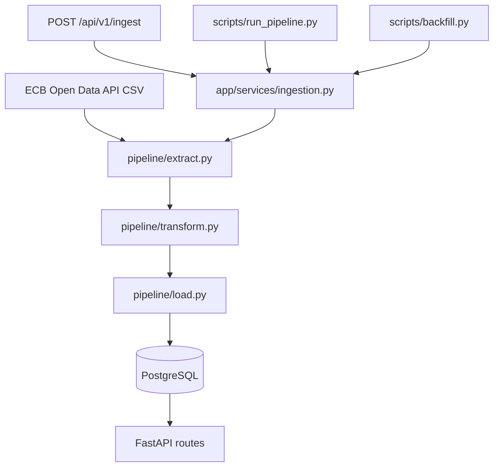

# Architecture

## Overview

The ECB Exchange Rate Pipeline ingests daily euro foreign exchange reference rates, normalizes them into a PostgreSQL OLTP schema, and serves queryable data through a FastAPI REST API.

## Data Flow



## Component Responsibilities

| Component | Responsibility |
|---|---|
| `app/services/ecb_client.py` | Async HTTP client, retries, CSV parsing |
| `pipeline/extract.py` | Thin wrapper around ECB client |
| `pipeline/transform.py` | Parse ECB quirks, validate DTOs |
| `pipeline/load.py` | Upsert lookup tables, series, observations |
| `app/services/ingestion.py` | Orchestrate ETL and write audit logs |
| `app/api/routes.py` | REST endpoints for series, observations, ingestion |
| `alembic/` | Version-controlled schema migrations |

## Retry and Error Handling

- ECB client retries HTTP `429` and `5xx` responses up to 3 times with exponential backoff (1s, 2s, 4s).
- Non-retryable HTTP errors raise `ECBApiError`.
- Transform stage logs and skips invalid rows instead of failing the batch.
- Ingestion runs are always recorded in `ingestion_run`; failures set `status='failed'` and store `error_message`.

## Idempotency Guarantees

- `exchange_rate_observation` has a unique constraint on `(series_id, time_period)`.
- Load stage uses PostgreSQL `ON CONFLICT DO UPDATE` upserts.
- Re-running ingestion for the same period updates existing values without creating duplicates.

## Deployment Topology (Docker)

```text
┌─────────────┐     ┌──────────────┐     ┌─────────────┐
│  migrate    │────▶│  PostgreSQL  │◀────│     api     │
│  (alembic)  │     │     :5432    │     │   :8000     │
└─────────────┘     └──────────────┘     └─────────────┘
```

The `migrate` service applies Alembic migrations before the API starts.

## Data transformation example

For a non-technical before/after view (raw CSV → cleaned records → normalised tables), see [data_transformation_example.md](data_transformation_example.md).

## Observability

- Structured logs for ECB requests (URL, status, latency, row count).
- `ingestion_run` table provides execution history and row counts.
- GitHub Actions `data_quality.yml` checks deployed ingestion freshness daily.
