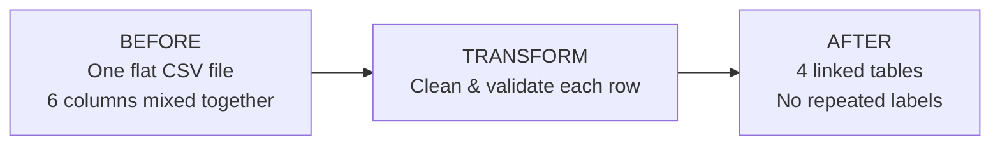

# Data Transformation Example (Before & After)

A plain-language walkthrough for **non-technical leads** showing how raw ECB data becomes clean, normalized database tables.

---

## The idea in one sentence

> We take one **wide, repetitive spreadsheet** from the ECB and reorganise it into **small, linked reference tables** — like splitting a messy Excel file into a proper data model that is easier to query, update, and trust.

---

## Visual journey



---

## BEFORE processing — raw ECB download

What arrives from the API is a **single flat table** (CSV). Every row repeats currency codes, frequency, and series metadata. It is fine for a one-off download but **hard to maintain** at scale.

**Example: 3 currencies × 2 days = 6 rows** (from our test fixture)

| KEY | FREQ | CURRENCY | CURRENCY_DENOM | EXR_TYPE | EXR_SUFFIX | TIME_PERIOD | OBS_VALUE |
|-----|------|----------|----------------|----------|------------|-------------|-----------|
| D.USD.EUR.SP00.A | D | USD | EUR | SP00 | A | 2026-01-02 | 1.0412 |
| D.JPY.EUR.SP00.A | D | JPY | EUR | SP00 | A | 2026-01-02 | 162.34 |
| D.GBP.EUR.SP00.A | D | GBP | EUR | SP00 | A | 2026-01-02 | 0.8321 |
| D.USD.EUR.SP00.A | D | USD | EUR | SP00 | A | 2026-01-03 | 1.0398 |
| D.JPY.EUR.SP00.A | D | JPY | EUR | SP00 | A | 2026-01-03 | 161.90 |
| D.GBP.EUR.SP00.A | D | GBP | EUR | SP00 | A | 2026-01-03 | 0.8310 |

**Problems with keeping data only in this form**

| Issue | Business impact |
|-------|-----------------|
| `USD`, `JPY`, `GBP` repeated on every row | Wastes space; risk of inconsistent spelling |
| `D` (daily) repeated on every row | Same frequency stored thousands of times |
| Long `KEY` string on every row | Hard to read; duplicated metadata |
| One giant table | Slow queries; difficult to add new currencies cleanly |

---

## DURING transformation — what the pipeline cleans

The **Transform** step reads each raw row and produces a **validated, simplified record** (ObservationDTO).

### Example: one raw row (USD, 2 Jan 2026)

**Input (raw CSV row)**

```
D.USD.EUR.SP00.A , D , USD , EUR , SP00 , A , 2026-01-02 , 1.0412
```

**Output (cleaned record)**

| Field | Value | What changed |
|-------|-------|--------------|
| series_key | D.USD.EUR.SP00.A | Kept as unique series identifier |
| freq_code | D | Extracted once (not repeated in storage) |
| currency_code | USD | Normalised to uppercase |
| exr_type | SP00 | Spot rate type |
| exr_var | A | Average rate |
| time_period | 2026-01-02 | Parsed as proper date |
| obs_value | 1.0412 | Converted to precise decimal |
| obs_status | (empty) | Optional ECB quality flag |

**Special rules non-technical leads should know**

| Raw value | After transform | Why |
|-----------|-----------------|-----|
| `.` in OBS_VALUE | empty / null | ECB uses dot to mean “no data that day” |
| `2026-01` (monthly) | `2026-01-01` | Monthly dates normalised to first of month |
| Invalid / broken row | skipped + logged | One bad row does not stop the whole batch |

---

## AFTER processing — normalised tables

The **Load** step splits cleaned records into **four linked tables** (3NF — third normal form).  
Think of it as replacing one busy spreadsheet with **a filing system**: labels in one drawer, rates in another.

### Lookup table: `frequency` (written once)

| id | code | description |
|----|------|-------------|
| 1 | D | Daily |

*“How often is this rate published?” — stored **once**, not on every row.*

### Lookup table: `currency` (one row per currency)

| id | iso_code | description |
|----|----------|-------------|
| 1 | USD | |
| 2 | JPY | |
| 3 | GBP | |

*“Which currency?” — each code appears **once** in this reference list.*

### Series table: `exchange_rate_series` (one row per rate type)

| id | series_key | freq_id | currency_id | exr_type | exr_var |
|----|------------|---------|-------------|----------|---------|
| 1 | D.USD.EUR.SP00.A | 1 | 1 | SP00 | A |
| 2 | D.JPY.EUR.SP00.A | 1 | 2 | SP00 | A |
| 3 | D.GBP.EUR.SP00.A | 1 | 3 | SP00 | A |

*“What exactly are we measuring?” — links frequency + currency + rate definition.*

### Facts table: `exchange_rate_observation` (the actual numbers)

| id | series_id | time_period | obs_value | obs_status |
|----|-----------|-------------|-----------|------------|
| 1 | 1 | 2026-01-02 | 1.04120000 | |
| 2 | 2 | 2026-01-02 | 162.34000000 | |
| 3 | 3 | 2026-01-02 | 0.83210000 | |
| 4 | 1 | 2026-01-03 | 1.03980000 | |
| 5 | 2 | 2026-01-03 | 161.90000000 | |
| 6 | 3 | 2026-01-03 | 0.83100000 | |

*“What was the rate on each day?” — only dates and values here; labels live in other tables.*

---

## Side-by-side: one USD rate across all stages

| Stage | What you see |
|-------|--------------|
| **Before (raw)** | `D.USD.EUR.SP00.A,D,USD,EUR,SP00,A,2026-01-02,1.0412` — everything in one line |
| **After transform** | series_key=USD daily series, date=2026-01-02, value=1.0412 (validated) |
| **After load — currency** | `currency` table: id=1, iso_code=**USD** |
| **After load — series** | `exchange_rate_series` id=1 points to USD + Daily |
| **After load — observation** | `exchange_rate_observation`: series 1, date 2026-01-02, value **1.0412** |

```text
RAW (1 wide row)                    NORMALISED (linked pieces)

KEY + FREQ + CURRENCY + ...         frequency (D)
        |                           currency (USD)
        +-- OBS_VALUE + DATE  -->   exchange_rate_series (USD daily)
                                    exchange_rate_observation (1.0412 on 2026-01-02)
```

---

## Physical analogy for stakeholders

Imagine a **paper archive**:

| Before (raw CSV) | After (normalised) |
|------------------|-------------------|
| Every page repeats “US Dollar, Daily, Spot Rate” | A **label card** for USD sits in the currency folder once |
| Rates scribbled on the same page as labels | A **rate ledger** only has dates and numbers |
| Adding EUR means copying header text again | Add one card to currency folder; new series; new observations |

---

## Comparison summary

| Aspect | Before (raw ECB CSV) | After (normalised tables) |
|--------|----------------------|---------------------------|
| Structure | 1 flat file | 4 linked tables |
| Currency `USD` | Repeated on every row | Stored once in `currency` |
| Frequency `D` | Repeated on every row | Stored once in `frequency` |
| Rate values | Mixed with metadata | Only in `exchange_rate_observation` |
| Duplicate days | Risk if file re-imported | Prevented by unique (series + date) |
| Query “latest USD rate” | Filter wide table | Simple join across small tables |
| Data quality | Raw strings | Validated types; bad rows skipped |

---

## What leaders can say in a meeting

1. **“We don’t store the same labels thousands of times.”**  
   Currency and frequency are reference lists.

2. **“The rate is separated from the description.”**  
   Observations are pure facts: date + number.

3. **“Re-importing the same day won’t duplicate data.”**  
   The pipeline updates existing rows (idempotent upsert).

4. **“We keep an audit trail.”**  
   Every pipeline run is logged in `ingestion_run` (rows fetched, inserted, errors).

---

## Optional: audit table after a successful run

| id | status | rows_fetched | rows_inserted | period_start | period_end |
|----|--------|--------------|---------------|--------------|------------|
| 1 | success | 6 | 6 | 2026-01-01 | 2026-01-03 |

---

## Related documentation

- Full schema: [database_schema.md](database_schema.md)
- Pipeline flow: [architecture.md](architecture.md)
- Sample raw file in repo: `tests/fixtures/ecb_sample.csv`
