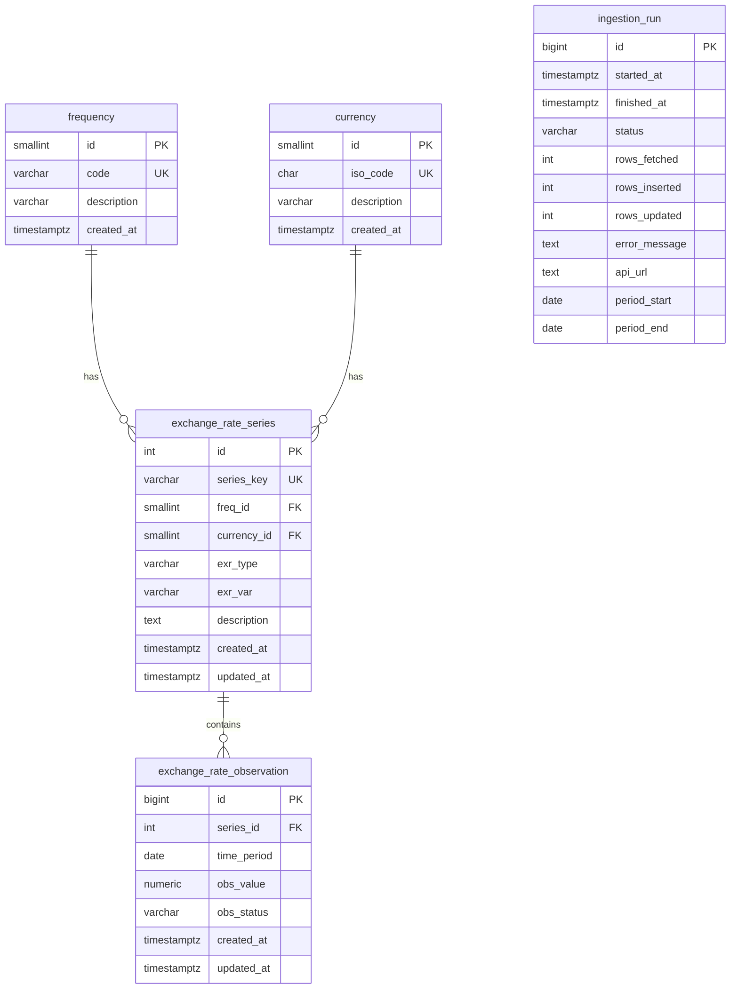

# Database Schema

## Entity Relationship Diagram



## Tables

### `frequency`

Lookup for ECB reporting frequencies.

| Column | Type | Notes |
|---|---|---|
| `id` | `SMALLINT` PK | Identity |
| `code` | `VARCHAR(4)` UNIQUE | e.g. `D`, `M`, `Q` |
| `description` | `VARCHAR(64)` | Human-readable label |
| `created_at` | `TIMESTAMPTZ` | Insert timestamp |

### `currency`

ISO 4217 currency codes from ECB series keys.

| Column | Type | Notes |
|---|---|---|
| `id` | `SMALLINT` PK | Identity |
| `iso_code` | `CHAR(3)` UNIQUE | e.g. `USD` |
| `description` | `VARCHAR(128)` | Optional label |
| `created_at` | `TIMESTAMPTZ` | Insert timestamp |

### `exchange_rate_series`

One row per ECB series key (e.g. `D.USD.EUR.SP00.A`).

| Column | Type | Notes |
|---|---|---|
| `id` | `SERIAL` PK | Surrogate key |
| `series_key` | `VARCHAR(64)` UNIQUE | ECB KEY |
| `freq_id` | `SMALLINT` FK | References `frequency` |
| `currency_id` | `SMALLINT` FK | References `currency` |
| `exr_type` | `VARCHAR(8)` | e.g. `SP00` |
| `exr_var` | `VARCHAR(8)` | e.g. `A` |
| `description` | `TEXT` | Optional |
| `created_at` / `updated_at` | `TIMESTAMPTZ` | Audit timestamps |

**Indexes**

- `idx_series_currency (currency_id)` — filter series by currency
- `idx_series_freq (freq_id)` — filter series by frequency

### `exchange_rate_observation`

One measurement per series and date.

| Column | Type | Notes |
|---|---|---|
| `id` | `BIGSERIAL` PK | Surrogate key |
| `series_id` | `INTEGER` FK | References series |
| `time_period` | `DATE` | Observation date |
| `obs_value` | `NUMERIC(18,8)` | NULL allowed for missing ECB values |
| `obs_status` | `VARCHAR(4)` | ECB status flag |
| `created_at` / `updated_at` | `TIMESTAMPTZ` | Audit timestamps |

**Constraints & Indexes**

- `UNIQUE (series_id, time_period)` — idempotent upserts
- `idx_obs_series_period (series_id, time_period DESC)` — series history queries
- `idx_obs_time_period (time_period DESC)` — cross-series date scans

### `ingestion_run`

Pipeline execution audit log (not part of 3NF domain model).

## Query Examples

Latest rate per currency:

```sql
SELECT c.iso_code, ers.series_key, o.time_period, o.obs_value
FROM exchange_rate_observation o
JOIN exchange_rate_series ers ON ers.id = o.series_id
JOIN currency c ON c.id = ers.currency_id
WHERE o.time_period = (
    SELECT MAX(o2.time_period)
    FROM exchange_rate_observation o2
    WHERE o2.series_id = o.series_id
)
ORDER BY c.iso_code;
```

USD daily history for January 2026:

```sql
SELECT o.time_period, o.obs_value
FROM exchange_rate_observation o
JOIN exchange_rate_series ers ON ers.id = o.series_id
WHERE ers.series_key = 'D.USD.EUR.SP00.A'
  AND o.time_period BETWEEN '2026-01-01' AND '2026-01-31'
ORDER BY o.time_period;
```

Recent failed ingestion runs:

```sql
SELECT id, started_at, error_message, period_start, period_end
FROM ingestion_run
WHERE status = 'failed'
ORDER BY started_at DESC
LIMIT 10;
```
